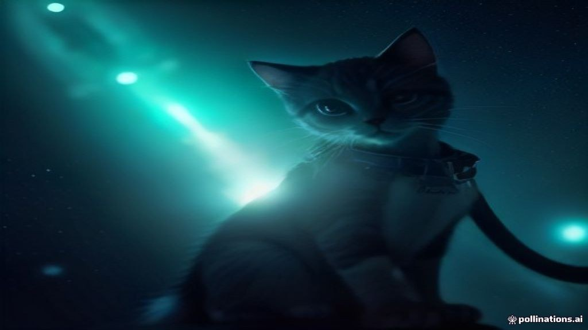
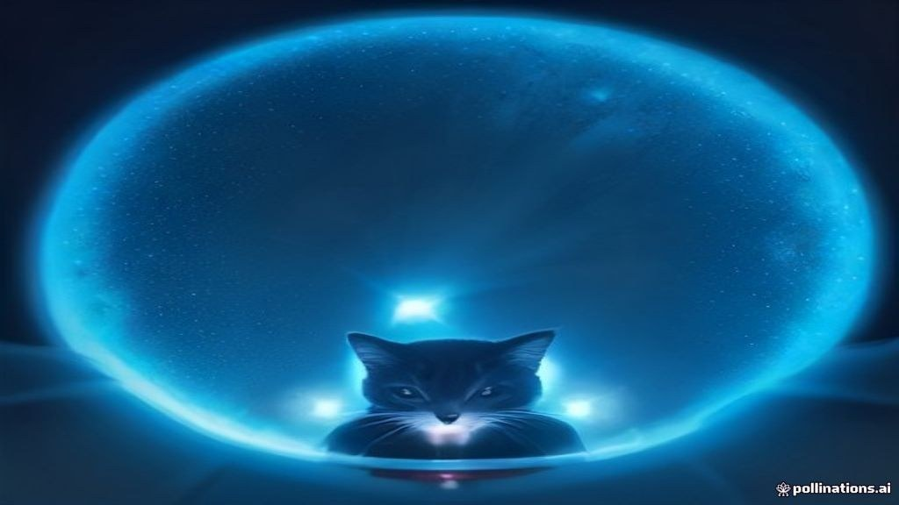
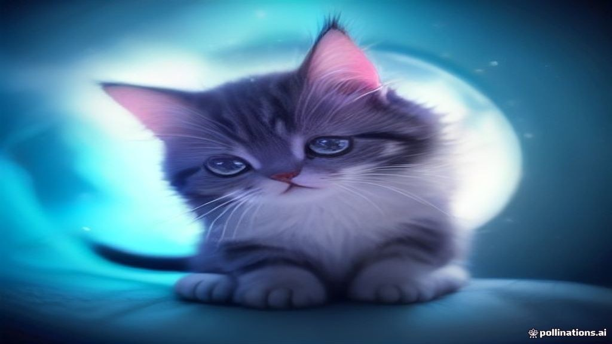
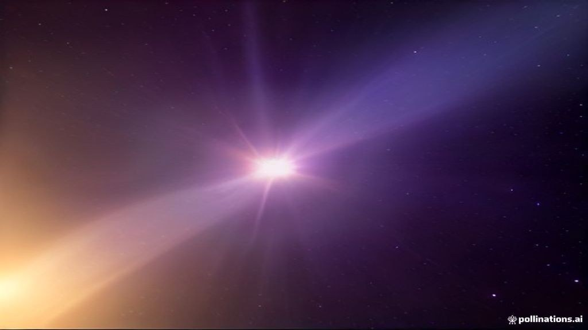
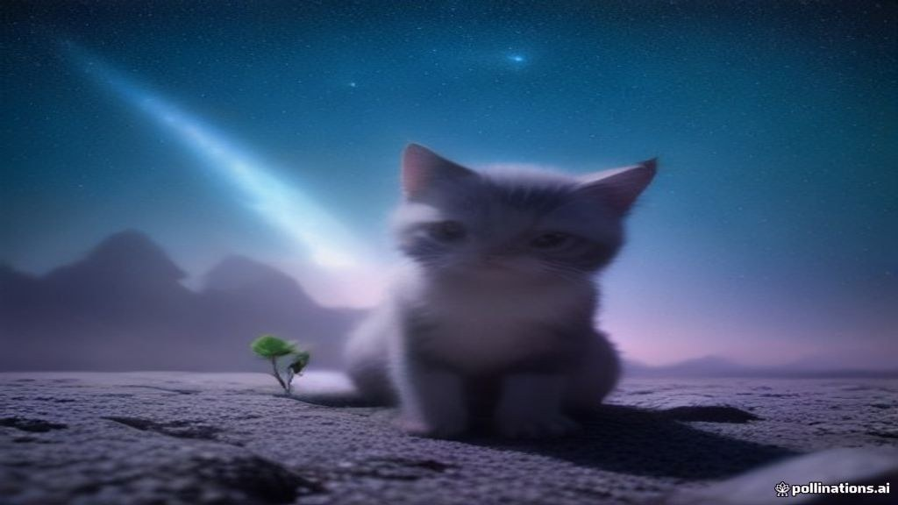

# Klavish — демо-прогон

- Идея: **Кот-астронавт открывает новую планету**
- Длина: 20 с → 5 сцен по ~4.6 с
- Рендер: 10.8 с → [klavish-demo.mp4](klavish-demo.mp4)
- Сценарий: ИИ (Pollinations text)
- ИИ-видео (alibaba/wan-2.2-fast) без ключа: ❌ HTTP 401 — {"success":false,"error":{"message":"A valid API key is required. Get one at https://enter.pollinations.ai/keys","code":"UNAUTHORIZED","timestamp":"2026-09-25T1 (нужен POLLINATIONS_KEY)
- Кадры: 5 из 5 нарисованы ИИ (Flux)
- ИИ-клипов с движением: 0 из 5

## Сцены

1. **На стартовом площадке кот-астронавт готов**  
   _A small, gleaming kitten in a crisp, teal spacesuit stands on a futuristic launch pad, its eyes wide with excitement. The pad is lined with glowing panels and a polished steel rocket laced with silver bolts. The backgrou_  
   
2. **Ракета поднимается, кот прыгает в реактив**  
   _The rocket ignites, spewing a plume of electric blue fire. The kitten, now in a small cockpit, shoves itself into a transparent cushion that activates the jet propulsion. The world blurs outside the viewport as the camer_  
   
3. **Кот скользит сквозь звездный вакуум**  
   _Inside the capsule, the kitten floats, tethered loosely to a charging port. Tiny planets and comet trails lag behind in a vortex of glittering stardust. The kitten’s whiskers twitch with anticipation; a miniature control_  
   
4. **Открывается сияющая новая планета**  
   _The gravitational pull slows the rocket, revealing a distant planet with a brilliant, violet ring. The surface glints with crystalline structures that refract light into a rainbow of colors. A descending plume of soft go_  
   
5. **Кот исследует поверхность, вдохновленный красотой**  
   _The kitten steps onto the planet's surface, its paws sinking into a cotton-candy like substrate. Around it, towering luminescent flora sway. The kitten's eyes widen, reflecting the kaleidoscopic skies; it reaches up, tou_  
   
